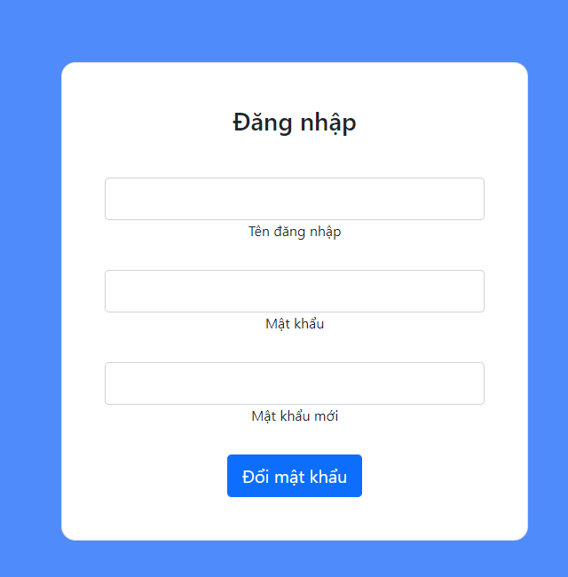
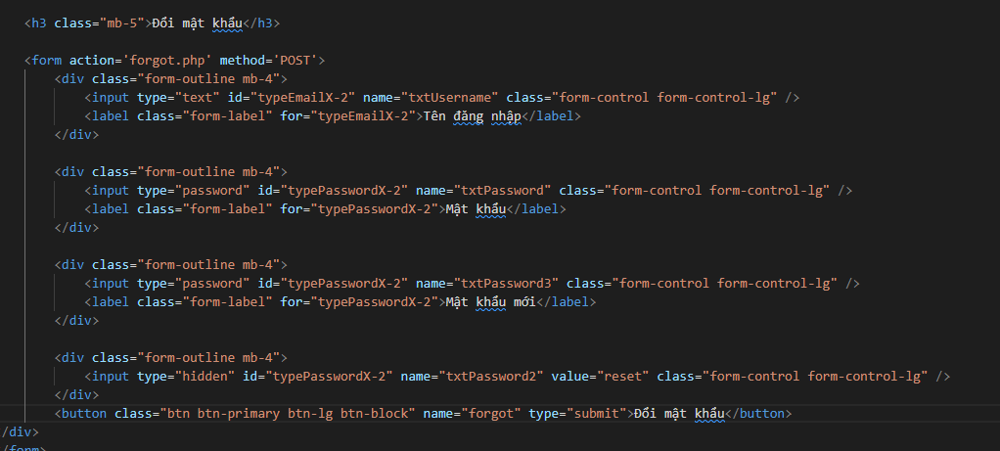
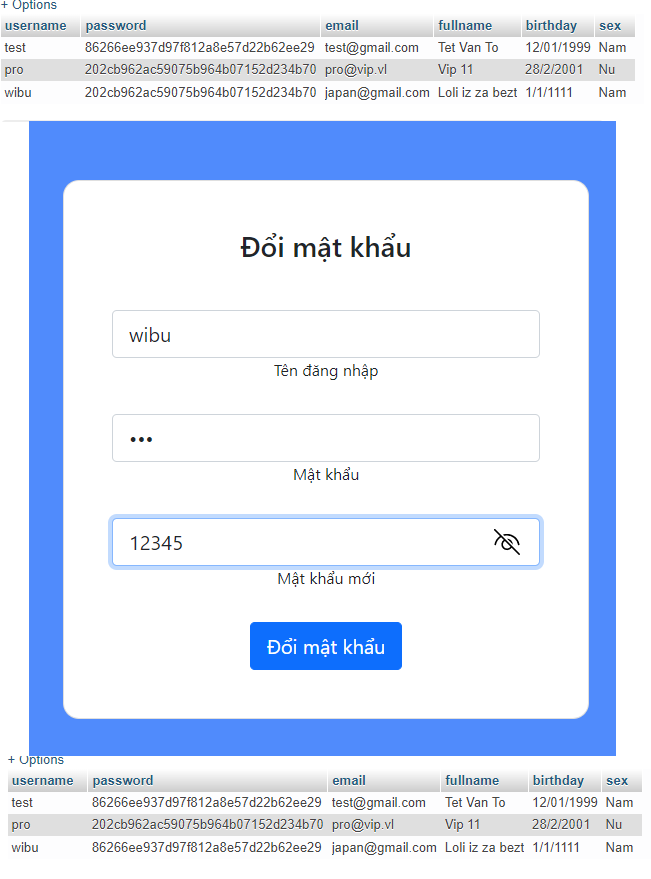
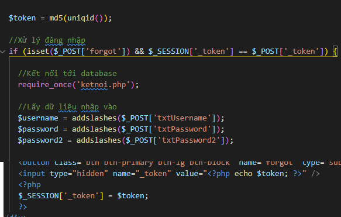
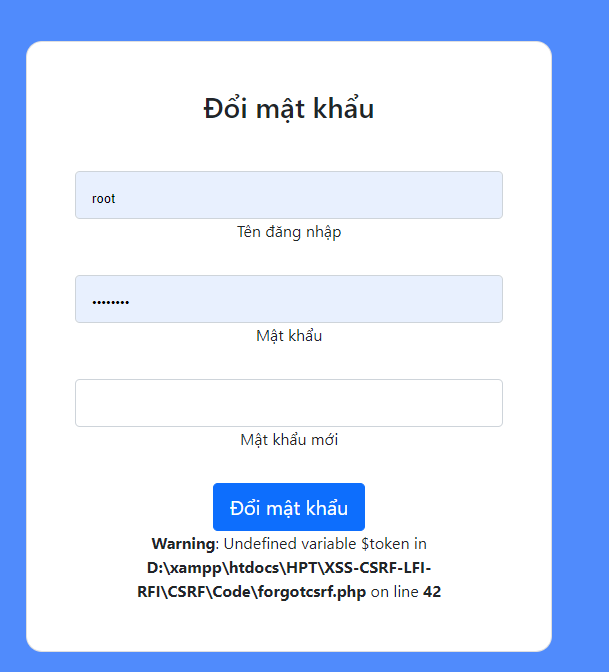

## Người thực hiện: Trần Ngọc Nam
## Ngày thực hiện: 16/5/2022

- Đây là giao diện web bị lỗi CSRF.
  
  

- Lúc này, kẻ tấn công sẽ view source web và tinh chỉnh lại form.
  
  

- Sau khi thực hiện xong, kẻ tấn công sẽ lừa người dùng truy cập trang web đã bị sửa đổi của hắn.
- Ví dụ trong trường hợp này, người dùng muốn đổi mật khẩu của user <code>wibu</code> từ <code>123</code> thành <code>12345</code>(Mã hóa md5 sẽ thành 827ccb0eea8a706c4c34a16891f84e7b).
- Nhưng lúc nãy mật khẩu đã bị đổi thành <code>86266ee937d97f812a8e57d22b62ee29</code>(Mã hóa md5 của reset). Vậy là kẻ tấn công đã thành công.
  
  

- Để giải quyết vấn đề này, ta có thể dùng token để kiểm tra.
  
  

- Lúc này khi người dùng đăng nhập đường link giả mạo sẽ nhận được thông báo lỗi để phòng ngừa.
  
  
