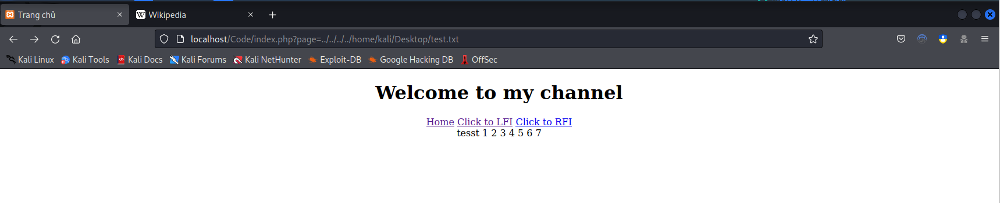
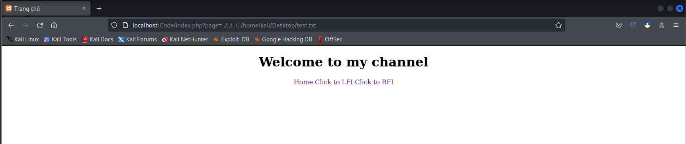

## Người thực hiện: Trần Ngọc Nam
## Ngày thực hiện: 18/5/2022

- Đây là giao diện web bị lỗi LFI.
  
  

- Vì trang web có dạng <code>?page=lfi.php</code> nên dễ dàng bị tấn công lfi với <code>?page=../../../../etc/password</code>.
  
  

- Như vậy, kẻ tấn công đã có thể xâm nhập được hệ thống 1 cách dễ dàng.
- Để ngăn chặn điều này, ta sử dụng hàm <code>str_place()</code> để xóa các giá trị được gán như <code>http://</code>, <code>https://</code>, các kí tự cho phép người dùng thoát khỏi thư mục và thay thế bằng giá trị " ".
  ```php
  if (isset($_GET['page'])) {
        $page = $_GET['page'];

        $page = str_replace(array("http://", "https://"), "", $page);
        $page = str_replace(array("../"), "", $page);

        include($page);
    }
  ```

- Đây là kết quả thu được sau khi thực hiện ngăn chặn.
  
  