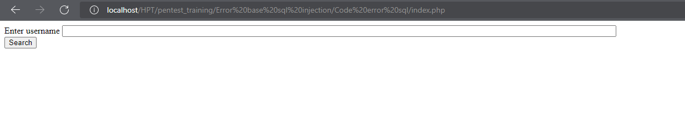
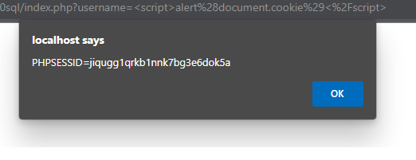
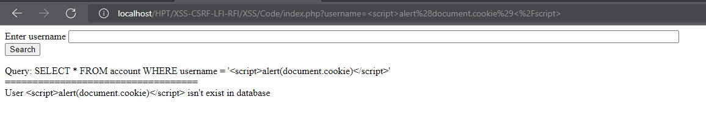

## Người thực hiện: Trần Ngọc Nam
## Ngày thực hiện: 15/5/2022

- Đây là giao diện trang web bị lỗi xss.

  
  
- Trang web dễ dàng bị tấn công bởi xss để lấy cookie và chiếm phiên làm việc.
  ```php
  <script>alert(document.cookie)</script>
  ```

  

- Để khắc phục điều này, ta sẽ dùng thêm hàm <code>test_input</code>
  ```php
  function test_input($data)
    {
      $data = trim($data);
      $data = stripslashes($data);
      $data = htmlspecialchars($data);
      return $data;
    }
  ```
- Đây là kết quả.
  